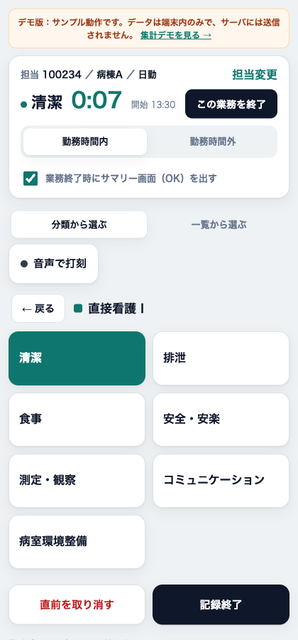
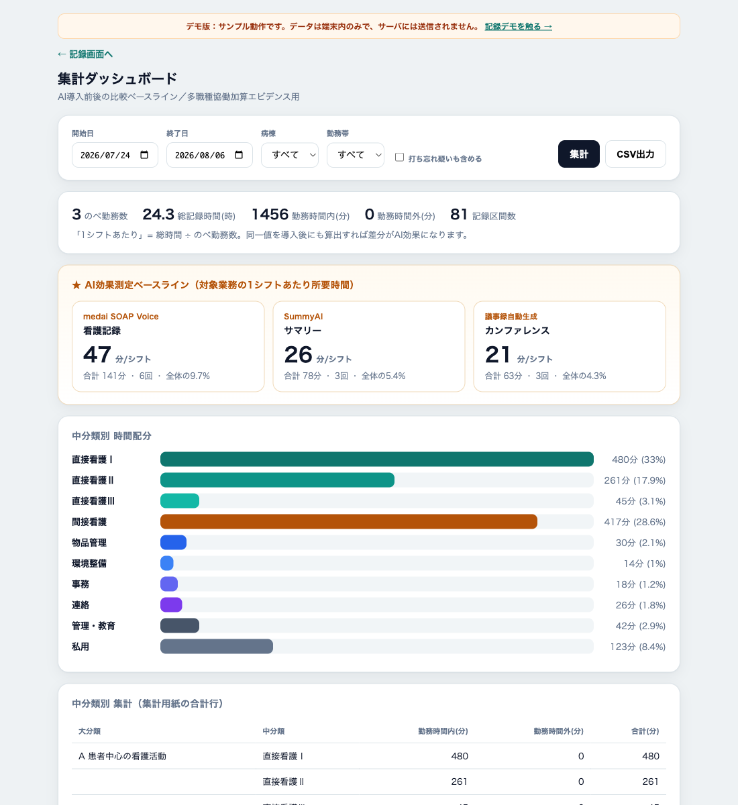

# 看護業務量調査ツール（Nursing Workload Logger）

看護業務にかかる時間を **「ボタン1タップ」** で記録し、AI（音声記録・退院時サマリー・議事録）
導入の **前後で効果を測る基準値（ベースライン）** を集めるための、オンプレ完結・PHIを扱わないツール。

👉 **プレビュー / デモ：** https://katu09161004.github.io/nursing-worktime/
（ブラウザだけで動く記録画面・集計ダッシュボードのデモが触れます）

---

## これは何か

看護師は「今やっている業務」のボタンを押すだけ。次のタップまでの時間が、その業務の所要時間として
自動で記録される（「開始／終了」の2度押しは不要）。集めたデータは次の2つに使える。

- **AI導入前後の比較ベースライン** … 導入前後で同条件測定 → 差分が削減効果
- **多職種協働加算のエビデンス** … 他職種へ移管可能な業務時間を「看護師○名相当」に換算

記録するのは **業務区分と時刻だけ**。担当者は匿名ID。患者情報は一切入力しない設計。

## 特長

- **ワンタップ記録** — 業務が切り替わるたびに1回押すだけ。所要時間は自動算出。
- **オフライン退避** — WiFiが切れても端末内に一時保存し、復帰時に自動再送。
- **AIベースライン自動集計** — SOAP入力・サマリー・カンファレンスを対象区分として分離し「分／シフト」で表示。
- **PHIレス** — 記録は業務区分と時刻のみ。
- **オンプレ／外部通信なし** — FastAPI + SQLite。院内サーバ1台で完結、データは1ファイル。
- **モバイル対応 & 常駐化** — ブラウザで開くだけ、ホーム画面追加でアプリ風、systemd常駐。

## スクリーンショット

| 記録画面 | 集計ダッシュボード |
|---|---|
|  |  |

## 使い方（クイックスタート）

```bash
pip install -r requirements.txt
uvicorn main:app --host 0.0.0.0 --port 8301
```

- 記録画面: `http://<サーバIP>:8301/`
- 集計ダッシュボード: `http://<サーバIP>:8301/dashboard`

導入の詳細は **[INSTALL.md](INSTALL.md)**、モバイル端末からの接続は **[DEPLOY-mobile.md](DEPLOY-mobile.md)** を参照。

## 構成

```
main.py                  FastAPI 本体（打刻→区間化→集計→CSV、SQLite）
index.html               記録画面（モバイル・オフライン退避・PWA）
dashboard.html           集計ダッシュボード
requirements.txt         依存（fastapi, uvicorn のみ）
nursing-worktime.service systemd ユニット
INSTALL.md               インストール手順
DEPLOY-mobile.md         モバイル接続ガイド
icons/                   アプリアイコン
manual/                  利用者マニュアル（PDF・画面付き）
docs/                    GitHub Pages 用プレビュー（静的デモ）
deploy/sync_export.py    別サーバへ渡す打刻・集計エントリの書き出し
deploy/sync_import.py    上記の取り込み（冪等・衝突は既定でスキップ）
google/nwt-sheets.gs     Googleスプレッドシートへ集計を自動取得（Apps Script）
```

### 2台構成でのデータ統合

サーバを2台（例: 院内LAN用とインターネット公開用）で動かすと DB が分かれる。
どちらか一方を「正」と決めて、もう一方から寄せられる。

```bash
ssh <サブ側> 'cd <アプリのパス> && ./.venv/bin/python deploy/sync_export.py' \
  | ssh <正の側> 'cd <アプリのパス> && ./.venv/bin/python deploy/sync_import.py --dry-run'
```

問題なければ `--dry-run` を外す。何度流しても二重計上しない（打刻は
`staff_id/ward/shift/区分/時刻` が同じなら入れない、集計エントリは `batch_id` 単位で入れ替え）。
接続情報は各サーバが自分の `config_local.py` から読むので、認証情報はどこにも渡らない。

同じ担当者が同じ日に両方のサーバへ記録していると、打刻が時刻順に交互に並んで
所要時間が壊れる。取り込み時に警告は出るが自動では直せないので、
**記録先は人・病棟・期間のいずれかで一意に決めて運用する。**

### 施設固有値について

病棟名・勤務帯・スタッフIDは、任意の `config_local.py`（`.gitignore` 済み）に置ける。
無ければ `main.py` の汎用既定（病棟A/B/C・N-01〜N-20）を使う。公開リポジトリに
施設固有情報を出さずに運用するための仕組み。

```python
# config_local.py（例・非公開）
WARDS  = ["○○病棟", "△△病棟", "..."]
SHIFTS = ["日勤", "夜勤", "早出", "遅出"]
STAFF  = ["N-01", "N-02", "..."]
```

業務区分そのものは `main.py` 冒頭の `CATEGORIES` を編集（`ai_tool` を付けた小区分がAI効果測定の対象）。

## 記録方式（設計メモ）

打刻式（状態遷移モデル）。DBに入るのは打刻の生ログのみで、区間の所要時間は集計時に
「次の打刻との時刻差」で算出する。よって後から区分定義を変えても過去データを再集計できる。

## 技術スタック

Python / FastAPI ・ SQLite ・ Vanilla JS（依存なし）・ systemd ・ PWA

## ライセンス

MIT License — [LICENSE](LICENSE) 参照。
